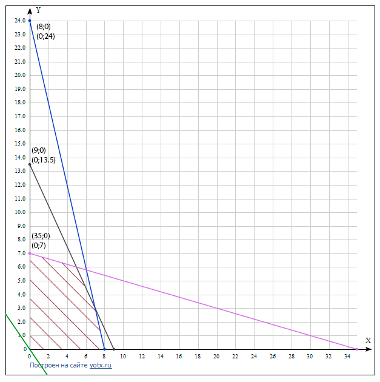
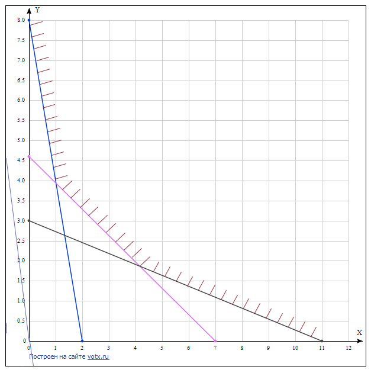

# 1

|  X  	|     Y    	|   	|     A    	|     B    	|     C    	|   F(A)   	|   F(B)   	|   F(C)  	|  abs(B-A)	|
|:---:	|:--------:	|:-:	|:--------:	|:--------:	|:--------:	|:--------:	|:--------:	|:--------:	|:--------:	|
| -10 	| -361,544 	|   	|     0    	|     1    	|    0,5   	|    -11   	| 1,158529 	| -7,10443 	|     1    	|
|  -9 	| -217,588 	|   	|    0,5   	|     1    	|   0,75   	| -7,10443 	| 1,158529 	| -3,57226 	|    0,5   	|
|  -8 	| -114,011 	|   	|   0,75   	|     1    	|   0,875  	| -3,57226 	| 1,158529 	| -1,36325 	|   0,25   	|
|  -7 	|  -45,343 	|   	|   0,875  	|     1    	|  0,9375  	| -1,36325 	| 1,158529 	| -0,14226 	|   0,125  	|
|  -6 	| -5,27942 	|   	|  0,9375  	|     1    	|  0,96875 	| -0,14226 	| 1,158529 	| 0,498057 	|  0,0625  	|
|  -5 	| 13,04108 	|   	|  0,9375  	|  0,96875 	| 0,953125 	| -0,14226 	| 0,498057 	|  0,17539 	|  0,03125 	|
|  -4 	|  16,2432 	|   	|  0,9375  	| 0,953125 	| 0,945313 	| -0,14226 	|  0,17539 	| 0,015939 	| 0,015625 	|
|  -3 	| 10,14112 	|   	|  0,9375  	| 0,945313 	| 0,941406 	| -0,14226 	| 0,015939 	| -0,06332 	| 0,007813 	|
|  -2 	|  -0,0907 	|   	| 0,941406 	| 0,945313 	| 0,943359 	| -0,06332 	| 0,015939 	| -0,02373 	| 0,003906 	|
|  -1 	| -9,15853 	|   	| 0,943359 	| 0,945313 	| 0,944336 	| -0,02373 	| 0,015939 	|  -0,0039 	| 0,001953 	|
|  0  	|    -11   	|   	| 0,944336 	| 0,945313 	| 0,944824 	|  -0,0039 	| 0,015939 	| 0,006015 	| 0,000977 	|
|  1  	| 1,158529 	|   	| 0,944336 	| 0,944824 	|  0,94458 	|  -0,0039 	| 0,006015 	| 0,001054 	| 0,000488 	|
|  2  	|  34,0907 	|   	| 0,944336 	|  0,94458 	| 0,944458 	|  -0,0039 	| 0,001054 	| -0,00143 	| 0,000244 	|
|  3  	| 93,85888 	|   	| 0,944458 	|  0,94458 	| 0,944519 	| -0,00143 	| 0,001054 	| -0,00019 	| 0,000122 	|
|  4  	| 185,7568 	|   	| 0,944519 	|  0,94458 	|  0,94455 	| -0,00019 	| 0,001054 	| 0,000434 	|  6,1E-05 	|
|  5  	| 314,9589 	|   	| 0,944519 	|  0,94455 	| 0,944534 	| -0,00019 	| 0,000434 	| 0,000124 	| 3,05E-05 	|
|  6  	| 487,2794 	|   	| 0,944519 	| 0,944534 	| 0,944527 	| -0,00019 	| 0,000124 	| -3,1E-05 	| 1,53E-05 	|
|  7  	|  709,343 	|   	| 0,944527 	| 0,944534 	|  0,94453 	| -3,1E-05 	| 0,000124 	| 4,69E-05 	| 7,63E-06 	|
|  8  	| 988,0106 	|   	| 0,944527 	|  0,94453 	| 0,944529 	| -3,1E-05 	| 4,69E-05 	| 8,14E-06 	| 3,81E-06 	|
|  9  	| 1329,588 	|   	| 0,944527 	| 0,944529 	| 0,944528 	| -3,1E-05 	| 8,14E-06 	| -1,1E-05 	| 1,91E-06 	|
|  10 	| 1739,544 	|   	| 0,944528 	| 0,944529 	| 0,944528 	| -1,1E-05 	| 8,14E-06 	| -1,6E-06 	| 9,54E-07 	|
|     	|          	|   	| 0,944528 	| 0,944529 	| 0,944528 	| -1,6E-06 	| 8,14E-06 	| 3,29E-06 	| 4,77E-07 	|
|     	|          	|   	| 0,944528 	| 0,944528 	| 0,944528 	| -1,6E-06 	| 3,29E-06 	| 8,71E-07 	| 2,38E-07 	|
|     	|          	|   	| 0,944528 	| 0,944528 	| 0,944528 	| -1,6E-06 	| 8,71E-07 	| -3,4E-07 	| 1,19E-07 	|
|     	|          	|   	| 0,944528 	| 0,944528 	| 0,944528 	| -3,4E-07 	| 8,71E-07 	| 2,66E-07 	| 5,96E-08 	|
|     	|          	|   	| 0,944528 	| 0,944528 	| 0,944528 	| -3,4E-07 	| 2,66E-07 	| -3,7E-08 	| 2,98E-08 	|
|     	|          	|   	| 0,944528 	| 0,944528 	| 0,944528 	| -3,7E-08 	| 2,66E-07 	| 1,14E-07 	| 1,49E-08 	|
|     	|          	|   	| 0,944528 	| 0,944528 	| 0,944528 	| -3,7E-08 	| 1,14E-07 	| 3,86E-08 	| 7,45E-09 	|
|     	|          	|   	| 0,944528 	| 0,944528 	| 0,944528 	| -3,7E-08 	| 3,86E-08 	| 7,86E-10 	| 3,73E-09 	|
|     	|          	|   	| 0,944528 	| 0,944528 	| 0,944528 	| -3,7E-08 	| 7,86E-10 	| -1,8E-08 	| 1,86E-09 	|
|     	|          	|   	| 0,944528 	| 0,944528 	| 0,944528 	| -1,8E-08 	| 7,86E-10 	| -8,7E-09 	| 9,31E-10 	|
|     	|          	|   	| 0,944528 	| 0,944528 	| 0,944528 	| -8,7E-09 	| 7,86E-10 	| -3,9E-09 	| 4,66E-10 	|
|     	|          	|   	| 0,944528 	| 0,944528 	| 0,944528 	| -3,9E-09 	| 7,86E-10 	| -1,6E-09 	| 2,33E-10 	|
|     	|          	|   	| 0,944528 	| 0,944528 	| 0,944528 	| -1,6E-09 	| 7,86E-10 	|  -4E-10  	| 1,16E-10 	|
|     	|          	|   	| 0,944528 	| 0,944528 	| 0,944528 	|  -4E-10  	| 7,86E-10 	| 1,95E-10 	| 5,82E-11 	|

# 2

|  X  	|     Y    	|   	|     A    	|     B    	|     C    	|   F(A)   	|   F(B)   	|   F(C)  	|    abs(B-A) 	|
|:---:	|:--------:	|:-:	|:--------:	|:--------:	|:--------:	|:--------:	|:--------:	|:--------:	|:-----------:	|
| -10 	| -361,544 	|   	|     0    	|     1    	| -318,047 	|    -11   	| 1,158529 	| -3,1E+07 	|      1      	|
|  -9 	| -217,588 	|   	| -318,047 	|     1    	| -526,635 	| -3,1E+07 	| 1,158529 	| -1,4E+08 	| 319,0470456 	|
|  -8 	| -114,011 	|   	| -526,635 	|     1    	| -632,646 	| -1,4E+08 	| 1,158529 	| -2,5E+08 	| 527,6349194 	|
|  -7 	|  -45,343 	|   	| -632,646 	|     1    	| -670,989 	| -2,5E+08 	| 1,158529 	|  -3E+08  	| 633,6455603 	|
|  -6 	| -5,27942 	|   	| -670,989 	|     1    	| -670,268 	|  -3E+08  	| 1,158529 	|  -3E+08  	| 671,9885736 	|
|  -5 	| 13,04108 	|   	| -670,268 	|     1    	| -652,227 	|  -3E+08  	| 1,158529 	| -2,7E+08 	| 671,2679891 	|
|  -4 	|  16,2432 	|   	| -652,227 	|     1    	| -631,984 	| -2,7E+08 	| 1,158529 	| -2,5E+08 	| 653,2269134 	|
|  -3 	| 10,14112 	|   	| -631,984 	|     1    	| -618,843 	| -2,5E+08 	| 1,158529 	| -2,3E+08 	|  632,983716 	|
|  -2 	|  -0,0907 	|   	| -618,843 	|     1    	| -616,933 	| -2,3E+08 	| 1,158529 	| -2,3E+08 	|  619,842596 	|
|  -1 	| -9,15853 	|   	| -616,933 	|     1    	| -625,092 	| -2,3E+08 	| 1,158529 	| -2,4E+08 	| 617,9332986 	|
|  0  	|    -11   	|   	| -625,092 	|     1    	| -636,092 	| -2,4E+08 	| 1,158529 	| -2,5E+08 	| 626,0918276 	|
|  1  	| 1,158529 	|   	| -636,092 	|     1    	| -635,933 	| -2,5E+08 	| 1,158529 	| -2,5E+08 	| 637,0918276 	|
|  2  	|  34,0907 	|   	| -635,933 	|     1    	| -603,843 	| -2,5E+08 	| 1,158529 	| -2,2E+08 	| 636,9332985 	|
|  3  	| 93,85888 	|   	| -603,843 	|     1    	| -512,984 	| -2,2E+08 	| 1,158529 	| -1,3E+08 	| 604,8425961 	|
|  4  	| 185,7568 	|   	| -512,984 	|     1    	| -331,227 	| -1,3E+08 	| 1,158529 	| -3,6E+07 	| 513,9837166 	|
|  5  	| 314,9589 	|   	| -331,227 	|     1    	|  -21,268 	| -3,6E+07 	| 1,158529 	| -6570,49 	| 332,2269157 	|
|  6  	| 487,2794 	|   	|  -21,268 	|     1    	| 459,9266 	| -6570,49 	| 1,158529 	| 98772408 	| 22,26800151 	|
|  7  	|  709,343 	|   	|  -21,268 	| 459,9266 	| -21,2213 	| -6570,49 	| 98772408 	| -6520,86 	| 481,1945698 	|
|  8  	| 988,0106 	|   	| -21,2213 	| 459,9266 	| -21,1566 	| -6520,86 	| 98772408 	| -6452,55 	|  481,147852 	|
|  9  	| 1329,588 	|   	| -21,1566 	| 459,9266 	| -21,0703 	| -6452,55 	| 98772408 	|  -6362,2 	| 481,0831569 	|
|  10 	| 1739,544 	|   	| -21,0703 	| 459,9266 	| -20,9589 	|  -6362,2 	| 98772408 	| -6246,77 	| 480,9968919 	|
|     	|          	|   	| -20,9589 	| 459,9266 	| -20,9589 	| -6246,77 	| 98772408 	| -6246,77 	| 480,8854945 	|
|     	|          	|   	| -20,9589 	| 459,9266 	| -20,9589 	| -6246,77 	| 98772408 	| -6246,77 	| 480,8854945 	|
|     	|          	|   	| 0,944528 	| 0,944528 	| 0,944528 	| -1,6E-06 	| 8,71E-07 	| -3,4E-07 	|   1,19E-07  	|
|     	|          	|   	| 0,944528 	| 0,944528 	| 0,944528 	| -3,4E-07 	| 8,71E-07 	| 2,66E-07 	|   5,96E-08  	|
|     	|          	|   	| 0,944528 	| 0,944528 	| 0,944528 	| -3,4E-07 	| 2,66E-07 	| -3,7E-08 	|   2,98E-08  	|
|     	|          	|   	| 0,944528 	| 0,944528 	| 0,944528 	| -3,7E-08 	| 2,66E-07 	| 1,14E-07 	|   1,49E-08  	|
|     	|          	|   	| 0,944528 	| 0,944528 	| 0,944528 	| -3,7E-08 	| 1,14E-07 	| 3,86E-08 	|   7,45E-09  	|
|     	|          	|   	| 0,944528 	| 0,944528 	| 0,944528 	| -3,7E-08 	| 3,86E-08 	| 7,86E-10 	|   3,73E-09  	|
|     	|          	|   	| 0,944528 	| 0,944528 	| 0,944528 	| -3,7E-08 	| 7,86E-10 	| -1,8E-08 	|   1,86E-09  	|
|     	|          	|   	| 0,944528 	| 0,944528 	| 0,944528 	| -1,8E-08 	| 7,86E-10 	| -8,7E-09 	|   9,31E-10  	|
|     	|          	|   	| 0,944528 	| 0,944528 	| 0,944528 	| -8,7E-09 	| 7,86E-10 	| -3,9E-09 	|   4,66E-10  	|
|     	|          	|   	| 0,944528 	| 0,944528 	| 0,944528 	| -3,9E-09 	| 7,86E-10 	| -1,6E-09 	|   2,33E-10  	|
|     	|          	|   	| 0,944528 	| 0,944528 	| 0,944528 	| -1,6E-09 	| 7,86E-10 	|  -4E-10  	|   1,16E-10  	|
|     	|          	|   	| 0,944528 	| 0,944528 	| 0,944528 	|  -4E-10  	| 7,86E-10 	| 1,95E-10 	|   5,82E-11  	|

# 6.1

| Виды сырья | Запасы | Кол-во сырья | Кол-во сырья |
| ---------- | ------ | ------------ | ------------ |
|            |        | P1           | P2           |
| S1         | 35     | 1            | 5            |
| S2         | 27     | 3            | 2            |
| S3         | 24     | 3            | 1            |
|            | Z      | 3            | 5            |

Z = 3x1 + 5x2 -> *max*

x1 >= 0, x2 >= 0

> x2 + 5x2 <= 35
> 
> 3x1 + 2x2 <= 27
> 
> 3x1 + x2 <= 24

**l2**: (9; 0), (0; 13.5)

**l3**: (8; 0), (0; 244)

**l1**: (35; 0), (10; 7)



3x1 + 5x2 = 0

x2 = -3x1 / 5

(5; -3); (0; 0);

> x1 + 5x2 = 35
> 
> 3x1 + 2x2 = 27

delta1 = 1 * 2 - 5 * 3 = -13

delta2 = 35 * 2 -  27 * 5 = -65

delta3 = 1 * 27 - 3 * 35 = -78

x1 = -65 / (-13) = 5

x2 = -72 / (-13) = 6

**Z** = 3 * 5 + 5 * 6= 15 + 30 = 45

# 6.2

| Питательные вещества | Потребность в питательных веществах | Количество единиц питательного вещества в 1 кг корма | Количество единиц питательного вещества в 1 кг корма |
|----------------------|-------------------------------------|------------------------------------------------------|------------------------------------------------------|
| S1                   | 8                                   | 4                                                    | 1                                                    |
| S2                   | 14                                  | 2                                                    | 3                                                    |
| S3                   | 22                                  | 2                                                    | 7                                                    |
| Цена 1 кг корма      | Цена 1 кг корма                     | 6                                                    | 4                                                    |

Z = 6x1 + 4x2 -> min

> 4x1 + x2 >= 8
> 
> 2x1 + 3x2 >= 14
> 
> 2x1 + 7x2 >= 22

> x1 >= 0
> 
> x2 >= 0

**l1**: 4x1 + x2 = 8; (0; 8) (2; 0);

**l2**: 2x1 + 3x2 = 14; (1; 4) (7; 0);

**l3**: 2x1 + 7x2 = 22; (4; 2) (11; 0);



delta = 4 * 3 - 1 * 2 = 10

delta1 = 8 * 3 - 14 * 3 = 10

delta2 = 4 * 14 - 2 * 8 = 40

> 4x1 + x2 = 8
> 
> 2x1 + 3x2 = 14

x1 = 1

x2 = 4

**Z*** = 6 + 4 * 4 = 22

# 6.3

|   5   	|   2   	|   7   	|   6   	|   8   	|   7   	|   9   	|   1   	|   0   	|   0   	|   0   	|    215   	|   	|  30,71429 	|
|:-----:	|:-----:	|:-----:	|:-----:	|:-----:	|:-----:	|:-----:	|:-----:	|:-----:	|:-----:	|:-----:	|:--------:	|:-:	|:---------:	|
|   7   	|   4   	|   8   	|   5   	|   7   	|   6   	|   4   	|   0   	|   1   	|   0   	|   0   	|    220   	|   	|  36,66667 	|
|   3   	|   4   	|   7   	|   3   	|   5   	|   8   	|   9   	|   0   	|   0   	|   1   	|   0   	|    270   	|   	|   33,75   	|
|   9   	|   3   	|   6   	|   5   	|   3   	|   9*   	|   6   	|   0   	|   0   	|   0   	|   1   	|    260   	|   	| 28,88889* 	|
|   -8  	|   -5  	|   -7  	|   -8  	|   -6  	|   -9  	|   -8  	|   0   	|   0   	|   0   	|   0   	|     0    	|   	|           	|
|       	|       	|       	|       	|       	|       	|       	|       	|       	|       	|       	|          	|   	|           	|
| -2,00 	| -0,33 	|  2,33 	|  2,11 	|  5,67* 	|  0,00 	|  4,33 	|  1,00 	|  0,00 	|  0,00 	| -0,78 	|   12,78  	|   	|  2,253968 	|
|  1,00 	|  2,00 	|  4,00 	|  1,67 	|  5,00 	|  0,00 	|  0,00 	|  0,00 	|  1,00 	|  0,00 	| -0,67 	|   46,67  	|   	|   9,334*  	|
| -5,00 	|  1,33 	|  1,67 	| -1,44 	|  2,33 	|  0,00 	|  3,67 	|  0,00 	|  0,00 	|  1,00 	| -0,89 	|   38,89  	|   	|  16,69099 	|
|  1,00 	|  0,33 	|  0,67 	|  0,56 	|  0,33 	|  1,00 	|  0,67 	|  0,00 	|  0,00 	|  0,00 	|  0,11 	|   28,89  	|   	|  87,54545 	|
|  1,00 	| -2,00 	| -1,00 	| -3,00 	| -3,00 	|  0,00 	| -2,00 	|  0,00 	|  0,00 	|  0,00 	|  1,00 	|  260,00  	|   	|           	|
|       	|       	|       	|       	|       	|       	|       	|       	|       	|       	|       	|          	|   	|           	|
| -0,35 	| -0,06 	|  0,41 	|  0,37 	|  1,00 	|  0,00 	|  0,76 	|  0,18 	|  0,00 	|  0,00 	| -0,14 	|   2,25   	|   	|   -38,73  	|
|  2,76 	|  2,29* 	|  1,95 	| -0,19 	|  0,00 	|  0,00 	| -3,82 	| -0,88 	|  1,00 	|  0,00 	|  0,02 	|   35,40  	|   	|   15,45*  	|
| -4,18 	|  1,47 	|  0,71 	| -2,31 	|  0,00 	|  0,00 	|  1,89 	| -0,41 	|  0,00 	|  1,00 	| -0,57 	|   33,64  	|   	|   22,95   	|
|  1,12 	|  0,35 	|  0,53 	|  0,44 	|  0,00 	|  1,00 	|  0,42 	| -0,06 	|  0,00 	|  0,00 	|  0,16 	|   28,15  	|   	|   80,60   	|
| -0,06 	| -2,17 	|  0,23 	| -1,88 	|  0,00 	|  0,00 	|  0,29 	|  0,53 	|  0,00 	|  0,00 	|  0,59 	|  266,76  	|   	|           	|
|       	|       	|       	|       	|       	|       	|       	|       	|       	|       	|       	|          	|   	|           	|
| -0,28 	|  0,00 	|  0,46 	|  0,37 	|  1,00 	|  0,00 	|  0,67 	|  0,15 	|  0,03 	|  0,00 	| -0,14 	|   3,15   	|   	|    4,73   	|
|  1,21 	|  1,00 	|  0,85 	| -0,08 	|  0,00 	|  0,00 	| -1,67 	| -0,38 	|  0,44 	|  0,00 	|  0,01 	|   15,45  	|   	|   -9,27   	|
| -5,95 	|  0,00 	| -0,53 	| -2,19 	|  0,00 	|  0,00 	|  4,33* 	|  0,15 	| -0,64 	|  1,00 	| -0,58 	|   10,99  	|   	|   2,54*   	|
|  0,70 	|  0,00 	|  0,24 	|  0,47 	|  0,00 	|  1,00 	|  1,00 	|  0,08 	| -0,15 	|  0,00 	|  0,15 	|   22,75  	|   	|   22,75   	|
|  2,57 	|  0,00 	|  2,08 	| -2,06 	|  0,00 	|  0,00 	| -3,33 	| -0,31 	|  0,95 	|  0,00 	|  0,60 	|  300,36  	|   	|           	|
|       	|       	|       	|       	|       	|       	|       	|       	|       	|       	|       	|          	|   	|           	|
|  0,63 	|  0,00 	|  0,54 	|  0,70* 	|  1,00 	|  0,00 	|  0,00 	|  0,13 	|  0,12 	| -0,15 	| -0,05 	|   1,46   	|   	|   2,08*   	|
| -1,08 	|  1,00 	|  0,64 	| -0,92 	|  0,00 	|  0,00 	|  0,00 	| -0,33 	|  0,19 	|  0,38 	| -0,22 	|   19,68  	|   	|   -21,31  	|
| -1,37 	|  0,00 	| -0,12 	| -0,50 	|  0,00 	|  0,00 	|  1,00 	|  0,04 	| -0,15 	|  0,23 	| -0,13 	|   2,54   	|   	|   -5,03   	|
|  2,07 	|  0,00 	|  0,36 	|  0,97 	|  0,00 	|  1,00 	|  0,00 	|  0,04 	|  0,00 	| -0,23 	|  0,29 	|   20,21  	|   	|   20,83   	|
| -2,01 	|  0,00 	|  1,67 	| -3,75 	|  0,00 	|  0,00 	|  0,00 	| -0,19 	|  0,46 	|  0,77 	|  0,16 	|  308,82  	|   	|           	|
|       	|       	|       	|       	|       	|       	|       	|       	|       	|       	|       	|          	|   	|           	|
|  0,90 	|  0,00 	|  0,77 	|  1,00 	|  1,42 	|  0,00 	|  0,00 	|  0,19 	|  0,18 	| -0,22 	| -0,07 	|   2,08   	|   	|   -9,50   	|
| -0,25 	|  1,00 	|  1,36 	|  0,00 	|  1,31 	|  0,00 	|  0,00 	| -0,15 	|  0,35 	|  0,18* 	| -0,28 	|   21,60  	|   	|  118,28*  	|
| -0,92 	|  0,00 	|  0,27 	|  0,00 	|  0,72 	|  0,00 	|  1,00 	|  0,13 	| -0,06 	|  0,12 	| -0,17 	|   3,58   	|   	|   -60,89  	|
|  1,20 	|  0,00 	| -0,39 	|  0,00 	| -1,38 	|  1,00 	|  0,00 	| -0,14 	| -0,18 	| -0,02 	|  0,35 	|   18,20  	|   	|  -103,61  	|
|  1,36 	|  0,00 	|  4,56 	|  0,00 	|  5,32 	|  0,00 	|  0,00 	|  0,50 	|  1,12 	| -0,05 	| -0,10 	|  316,60  	|   	|           	|
|       	|       	|       	|       	|       	|       	|       	|       	|       	|       	|       	|          	|   	|           	|
|  0,60 	|  1,20 	|  2,40 	|  1,00 	|  2,99 	|  0,00 	|  0,00 	|  0,00 	|  0,60 	|  0,00 	| -0,40 	|   27,95  	|   	|   -69,66  	|
| -1,37 	|  5,48 	|  7,43 	|  0,00 	|  7,19 	|  0,00 	|  0,00 	| -0,85 	|  1,93 	|  1,00 	| -1,52 	|  118,28  	|   	|   -77,61  	|
| -0,75 	| -0,66 	| -0,63 	|  0,00 	| -0,15 	|  0,00 	|  1,00 	|  0,23 	| -0,29 	|  0,00 	|  0,02* 	|  -10,67  	|   	|  -694,25  	|
|  1,17 	|  0,10 	| -0,25 	|  0,00 	| -1,25 	|  1,00 	|  0,00 	| -0,15 	| -0,14 	|  0,00 	|  0,32 	|   20,39  	|   	|   62,85*  	|
|  1,29 	|  0,27 	|  4,93 	|  0,00 	|  5,68 	|  0,00 	|  0,00 	|  0,46 	|  1,21 	|  0,00 	| -0,17 	|  322,51  	|   	|           	|
|       	|       	|       	|       	|       	|       	|       	|       	|       	|       	|       	|          	|   	|           	|
|  2,05 	|  1,32 	|  2,09 	|  1,00 	|  1,45 	|  1,24 	|  0,00 	| -0,19 	|  0,43 	|  0,00 	|  0,00 	|   53,16  	|   	|           	|
|  4,12 	|  5,95 	|  6,25 	|  0,00 	|  1,33 	|  4,70 	|  0,00 	| -1,57 	|  1,28 	|  1,00 	|  0,00 	|  214,07  	|   	|           	|
| -0,81 	| -0,66 	| -0,62 	|  0,00 	| -0,09 	| -0,05 	|  1,00 	|  0,24 	| -0,29 	|  0,00 	|  0,00 	|  -11,63  	|   	|           	|
|  3,61 	|  0,31 	| -0,77 	|  0,00 	| -3,84 	|  3,08 	|  0,00 	| -0,48 	| -0,43 	|  0,00 	|  1,00 	|   62,85  	|   	|           	|
|  1,91 	|  0,33 	|  4,79 	|  0,00 	|  5,02 	|  0,53 	|  0,00 	|  0,38 	|  1,14 	|  0,00 	|  0,00 	| 333,37** 	|   	|           	|

# 7

## Метод северо-западного угла

| Станции     	| Склады   	| Склады          	| Склады          	| Склады   	| Запасы            	|
|-------------	|----------	|-----------------	|-----------------	|----------	|-------------------	|
|             	| B1     	| B2       	        | B3       	        | B4       	|                   	|
| A1          	| 7 / 85   	| 4 / 35          	| 15 / -          	| 9 / -    	| ~~120~~ ~~35~~  0 	|
| A2          	| 4 / -    	| 2 / 30          	| 7 / 50          	| 3 / -    	| ~~80~~ ~~50~~ 0   	|
| A3          	| 4 / -    	| 5 / -           	| 12 / 40         	| 8 / 60   	| ~~100~~ ~~60~~ 0  	|
| Вместимость 	| ~~85~~ 0 	| ~~65~~ ~~30~~ 0 	| ~~50~~ ~~40~~ 0 	| ~~60~~ 0 	| 300               	|

Z = 7 * 58 + 4 * 35 + 2 * 30 + 7 * 50 + 12 * 40 + 8 * 60 = 2105

## Метод наименьшего значения

| Станции     	| Склады   	| Склады   	| Склады   	| Склады                 	| Запасы            	|
|-------------	|----------	|----------	|----------	|------------------------	|-------------------	|
|             	| B1     	| B2       	| B3       	| B4                       	|                   	|
| A1          	| 7 / -    	| 4 / -    	| 15 / 90  	| 9 / 30                 	| ~~120~~ ~~90~~  0 	|
| A2          	| 11 / -   	| 2 / 65   	| 7 / -    	| 3 / 15                 	| ~~80~~ ~~15~~ 0   	|
| A3          	| 4 / 85   	| 5 / -    	| 12 / -   	| 8 / 15                 	| ~~100~~ ~~15~~ 0  	|
| Вместимость 	| ~~85~~ 0 	| ~~65~~ 0 	| ~~90~~ 0 	| ~~60~~ ~~45~~ ~~30~~ 0 	| 300               	|

Z = 15 * 90 + 9 * 30 + 2 * 65 + 3 * 15 + 4 * 85 + 8 * 15 = 2255

## Метод двойного предпочтения

| Станции     	| Склады      	| Склады      	| Склады    	| Склады                 	| Запасы            	|
|-------------	|-------------	|-------------	|-----------	|------------------------	|-------------------	|
|             	| B1          	| B2          	| B3        	| B4                     	|                   	|
| A1          	| 7 / -       	| 4 / + / -   	| 15 / 90   	| 9 / 30                 	| ~~120~~ ~~90~~  0 	|
| A2          	| 11 / -      	| 2 / ++ / 65 	| 7 / + / - 	| 3 / + / 15             	| ~~80~~ ~~15~~ 0   	|
| A3          	| 4 / ++ / 85 	| 5 / -       	| 12 / -    	| 8 / 15                 	| ~~100~~ ~~15~~ 0  	|
| Вместимость 	| ~~85~~ 0    	| ~~65~~ 0    	| ~~90~~ 0  	| ~~60~~ ~~45~~ ~~30~~ 0 	| 300               	|

Z = 15 * 90 + 9 * 30 + 2 * 65 + 3 * 15 + 4 * 85 + 8 * 15 = 2255

## Метод потенциалов

| Станции     	|                	| Склады                           	| Склады         	| Склады          	| Склады                            	| Запасы 	|
|-------------	|----------------	|----------------------------------	|----------------	|-----------------	|-----------------------------------	|--------	|
|             	|                	| B1                               	| B2             	| B3              	| B4                                	|        	|
|             	|                	| V1 = ~~7~~ 5                     	| V2 = 4         	| V3 = ~~15~~ 13  	| V4 = 9                            	|        	|
| A1          	| U1 = 0         	| ```\|-```  7 / ~~55~~ 0 *-*       | ```-``` 4 / 65 	| ```-``` 15 / -  	| ```-\|``` 9 / ~~55~~ - ```2``` *+* 	| 120    	|
| A2          	| U2 = ~~-8~~ -6 	| ```\|``` 11 / -                  	| 2 / -          	| 7 / 80          	| ```\|``` 3 / -                     	| 80     	|
| A3          	| U3 = ~~-3~~ -1 	| ```\|-``` 4 / ~~30~~ ```85``` *+*	| ```-``` 5 / -  	| ```-``` 12 / 10 	| ```-\|``` 8 / ~~-60~~ 5 *-*        	| 100    	|
| Вместимость 	|                	| 85                               	| 65             	| 90              	| 60                                	| 300    	|

Z* = 4 * 65 + 80 * 7 + 85 * 4 + 10 * 12 + 5 * 8 = 1815
